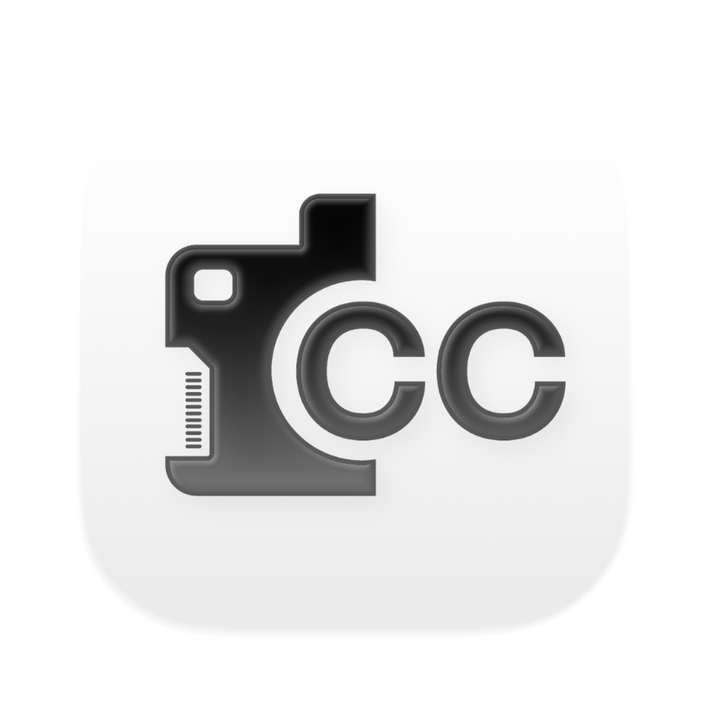
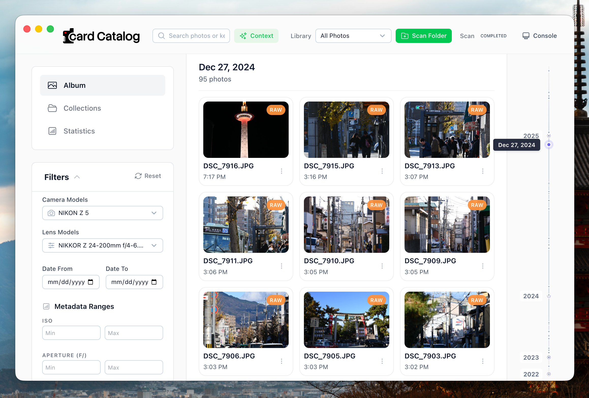
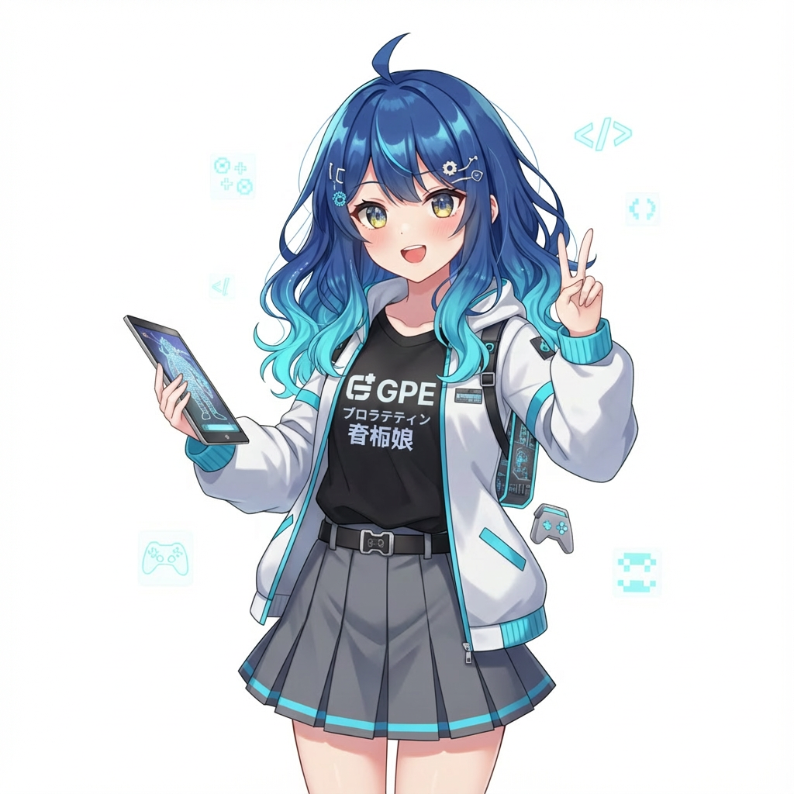

<p align="center">
  
</p>

<h1 align="center">Card Catalog <br><br></h1>



**CardCatalog** is a smart, local-first desktop application for photographers to catalog, search, and visualize their photo collections. Built with Electron and Nuxt, it runs entirely offline and uses local AI to help you find your best shots.


## ✨ Key Features

### 🧠 Smart AI Search (Offline)

* **Semantic Search:** Find photos by describing them (e.g., "sunset at the beach", "dog playing in snow") using local CLIP models.
* **Auto-Tagging:** Automatically generates keywords for your photos without sending data to the cloud.
* **Privacy First:** All AI processing happens on your machine.

### 📂 Powerful Organization

* **SD Card & Folder Scanning:** Quickly index photos from removable media or local drives.
* **Metadata Extraction:** Automatically pulls EXIF data including Camera Model, Lens, ISO, Aperture, and Focal Length.
* **Geocoding:** Visualizes where your photos were taken.

### 🔍 Advanced Filtering

Drill down into your library with precision filters:

* **Gear:** Filter by specific Camera Bodies or Lenses.
* **Settings:** Filter by ISO, Aperture, and Focal Length ranges.
* **Time:** Jump to specific dates with the interactive Timeline Rail.

### 📊 Insights & Stats

* **Dashboard:** View statistics about your shooting habits (most used cameras, favorite focal lengths).
* **Timeline:** Visual distribution of your photo history.

## 🚀 Getting Started

Download the latest version from the [Releases page](https://github.com/BroWo1/CardCatalog/releases).

## 🛠️ Tech Stack

* **Core:** [Electron](https://www.electronjs.org/)
* **UI:** [Nuxt 4](https://nuxt.com/) (Vue 3) + [Nuxt UI](https://ui.nuxt.com/)
* **Database:** [sql.js](https://sql.js.org/) (SQLite)
* **AI:** [Transformers.js](https://huggingface.co/docs/transformers.js/index) (ONNX Runtime)
* **Workers:** Heavy tasks (EXIF, AI) run in background threads for a buttery smooth UI.

## 💻 Development Setup

### Prerequisites

* Node.js (v18+ recommended)
* npm

### Installation

1. **Clone the repository**

   ```bash
   git clone https://github.com/yourusername/CardCatalog.git
   cd CardCatalog
   ```

2. **Install dependencies**

   ```bash
   npm install
   ```

3. **Download AI Models**

   This step is required to enable semantic search features.

   ```bash
   npm run download-models
   ```

### Development

Run the renderer and Electron process in separate terminals:

1. **Start the Renderer (UI)**

   ```bash
   npm run dev:renderer
   ```

2. **Start the Electron App**

   ```bash
   npm run dev
   ```

### Building for Production

To create a distributable package for your OS:

```bash
npm run package
# or to create installers
npm run make
```

## 👥 Contributors

* **Will Li**
* **GPE Club** 

 

## 📝 License

MIT
